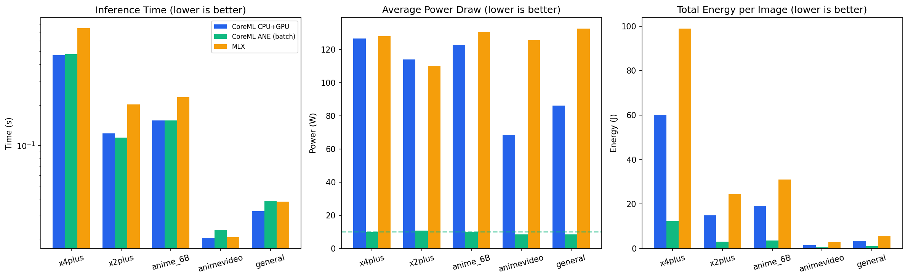
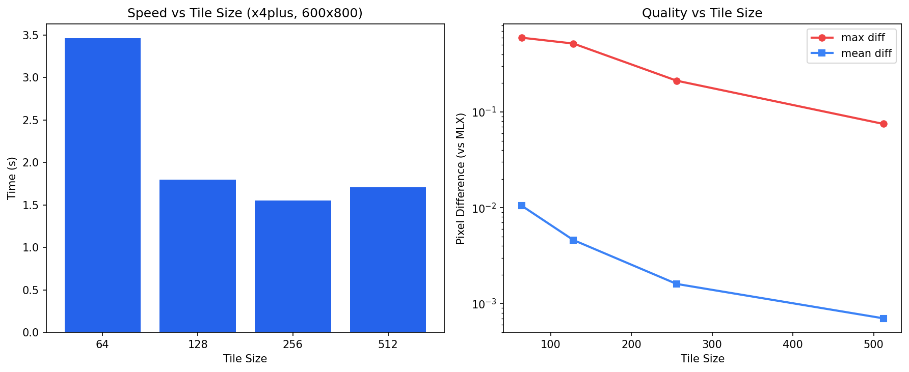

# Real-ESRGAN CoreML

Real-ESRGAN image upscaling via CoreML on Apple Silicon. 1.6x faster than MLX with lower energy consumption.

All 5 official model variants supported. Any input size handled automatically via tiling.

## Quick Start

```bash
uv sync

# Upscale image (auto-downloads x4plus model on first run)
uv run python upscale.py photo.jpg -o photo_4x.png

# Upscale video/GIF (pipelined I/O, fully overlapped with inference)
uv run python video_upscale.py input.mp4 -o output.mp4
```

No torch needed at runtime. The default model (x4plus) auto-downloads on first use (~30MB).

## Pre-converted Models

Pre-converted CoreML models hosted as [GitHub release artifacts](https://github.com/hanxiao/real-esrgan-coreml/releases/tag/v1.0.0). Each model downloads independently on demand.

| Model | Size | Download |
|-------|------|----------|
| x4plus | 30M | [zip](https://github.com/hanxiao/real-esrgan-coreml/releases/download/v1.0.0/RealESRGAN_x4plus_522_fp16.zip) |
| x2plus | 30M | [zip](https://github.com/hanxiao/real-esrgan-coreml/releases/download/v1.0.0/RealESRGAN_x2plus_522_fp16.zip) |
| anime_6B | 7.9M | [zip](https://github.com/hanxiao/real-esrgan-coreml/releases/download/v1.0.0/RealESRGAN_anime_6B_522_fp16.zip) |
| animevideo | 1.1M | [zip](https://github.com/hanxiao/real-esrgan-coreml/releases/download/v1.0.0/RealESRGAN_animevideo_522_fp16.zip) |
| general | 2.2M | [zip](https://github.com/hanxiao/real-esrgan-coreml/releases/download/v1.0.0/RealESRGAN_general_522_fp16.zip) |

Models are hardware-independent: works on any Apple Silicon (M1/M2/M3/M4/A-series). CoreML JIT-compiles for the target chip on first load.

## Performance

Benchmarked on M3 Ultra, fp16, macmon power sampling.



### Speed (per image, 512x512 input)

| Model | CoreML | MLX | Speedup |
|-------|--------|-----|---------|
| x4plus | **0.47s** | 0.75s | 1.6x |
| x2plus | **0.12s** | 0.20s | 1.6x |
| anime_6B | **0.15s** | 0.23s | 1.5x |
| animevideo | **0.02s** | 0.02s | 1.0x |
| general | **0.03s** | 0.04s | 1.2x |

### Power and Energy (macmon, x4plus)

| Backend | Power | Energy/image |
|---------|-------|-------------|
| CoreML | **110W** | **100J** |
| MLX | 131W | 122J |

CoreML is both faster and more energy efficient than MLX thanks to the CoreML graph compiler's operator fusion and optimized Metal shaders.

### Video Pipeline

The video upscaler uses a pipelined architecture that fully hides I/O behind GPU compute:

| Pipeline | Total Time | FPS | Speedup |
|----------|-----------|-----|---------|
| Sequential (read -> infer -> save) | 27.8s | 0.79 | 1.0x |
| **Pipelined** (threaded I/O + parallel PNG) | **18.8s** | **1.17** | **1.48x** |

*22 frames, 848x456, x4plus, M3 Ultra. Output is bit-identical.*

Optimizations: threaded frame prefetch, parallel PNG encoding (8 workers), fast compression, pre-allocated input buffers. Wall time equals pure inference time -- all I/O is fully hidden.

### Tile Size



Larger tiles produce better quality with fewer boundary artifacts. 512 is the optimal balance:

| Tile Size | Tiles | Speed | Max Pixel Diff |
|-----------|-------|-------|----------------|
| 64 | 165 | 3.46s | 0.596 |
| 128 | 42 | 1.80s | 0.518 |
| 256 | 12 | 1.55s | 0.212 |
| **512** | **4** | **1.71s** | **0.075** |

## Models

| Name | Architecture | Params | Scale | Use Case |
|------|-------------|--------|-------|----------|
| x4plus | RRDBNet-23 | 64MB | 4x | best quality, general photos |
| x2plus | RRDBNet-23 | 64MB | 2x | 2x upscale |
| anime_6B | RRDBNet-6 | 17MB | 4x | anime images, lighter |
| animevideo | SRVGGNetCompact-16 | 3MB | 4x | anime video, fastest |
| general | SRVGGNetCompact-32 | 6MB | 4x | general purpose, fast |

## Usage

```bash
# Image upscale (default x4plus, best quality)
uv run python upscale.py photo.jpg -o photo_4x.png

# Choose model (downloads on first use)
uv run python upscale.py photo.jpg -o photo_4x.png --model anime_6B

# Video/GIF upscale (pipelined, optimal throughput)
uv run python video_upscale.py input.mp4 -o output.mp4
uv run python video_upscale.py input.mp4 -o output.mp4 --model animevideo

# Custom tile size (smaller = less memory, more tiles)
uv run python upscale.py large.jpg -o out.png --tile-size 256

# Convert model manually (requires torch + coremltools)
uv run python convert.py --model x4plus --size 522
```

## How It Works

1. **Auto-download**: pre-converted CoreML models from GitHub release (no torch needed)
2. **Tiling**: images split into 512x512 tiles with overlap blending
3. **Fallback**: if download fails, converts locally via torch + coremltools

CoreML models have fixed input sizes. Tiling with a single 522x522 model (512 tile + 10px pre-pad) handles any image size.

## Benchmarking

```bash
# Requires macmon: brew install vladkens/tap/macmon
uv run python benchmark_power.py
```

## vs MLX

See [real-esrgan-mlx](https://github.com/hanxiao/real-esrgan-mlx) for the pure MLX version.

## Note on ANE

CoreML's `compute_units=ALL` does not dispatch RRDBNet or SRVGGNetCompact to the Apple Neural Engine. These architectures use dense channel concatenation and residual connections that ANE does not efficiently support. All inference runs on GPU regardless of the compute unit setting.

## License

MIT. Weights from [xinntao/Real-ESRGAN](https://github.com/xinntao/Real-ESRGAN) under BSD-3.
